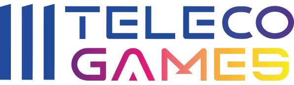
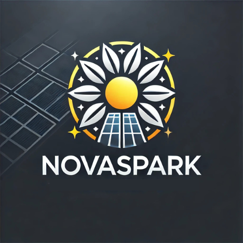
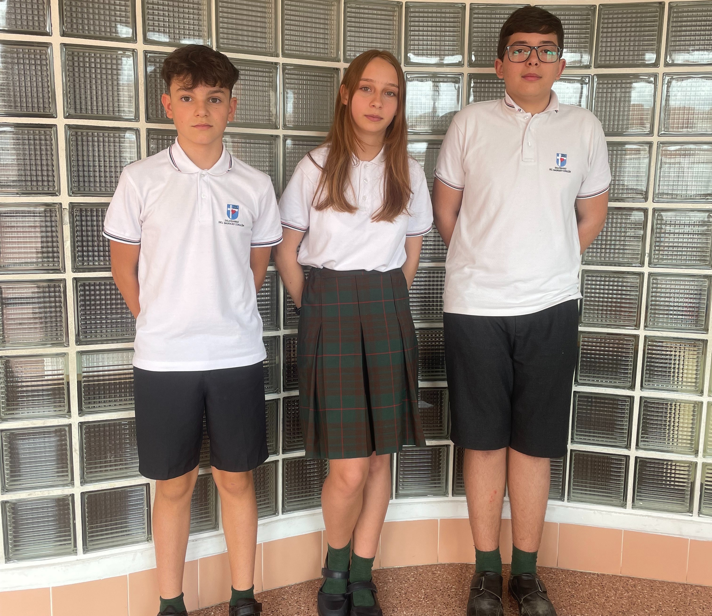

# 🚀 NovaSpark – Olimpiadas de Telecomunicaciones 2025

¡Bienvenido al repositorio oficial del equipo **NovaSpark**! 🌟  

Somos un equipo apasionado por la innovación y las telecomunicaciones, participando en las **Olimpiadas de Telecomunicaciones 2025**. Nuestro objetivo es desarrollar soluciones tecnológicas que impulsen la conectividad y la eficiencia en el mundo moderno.

## 📌 Sobre Nosotros  

NovaSpark está formado por un grupo de entusiastas de la tecnología, comprometidos con el avance de las telecomunicaciones. Nuestro enfoque combina creatividad, ingeniería y trabajo en equipo para enfrentar los desafíos de la competencia.

## 🚀 Proyecto Destacado  
En esta edición de las Olimpiadas, estamos trabajando en un **Solar Tracker**, una solución innovadora que sigue el ODS7 que **garantiza el acceso universal a una energía asequible, segura, sostenible y moderna, para mejorar las condiciones de vida de millones de personas.**.

## 🛠️ Tecnologías  
Estamos utilizando una variedad de tecnologías y herramientas clave para el desarrollo de nuestro proyecto, incluyendo:

## 👥 Integrantes  
- **Pacheco** –  
- **Amado** – 
- **Sofía** –

## 📢 Contacto  
¿Quieres saber más sobre nuestro proyecto? ¡No dudes en ponerte en contacto con nosotros!   

¡Síguenos en nuestro camino hacia la innovación en telecomunicaciones! 🚀🔥
